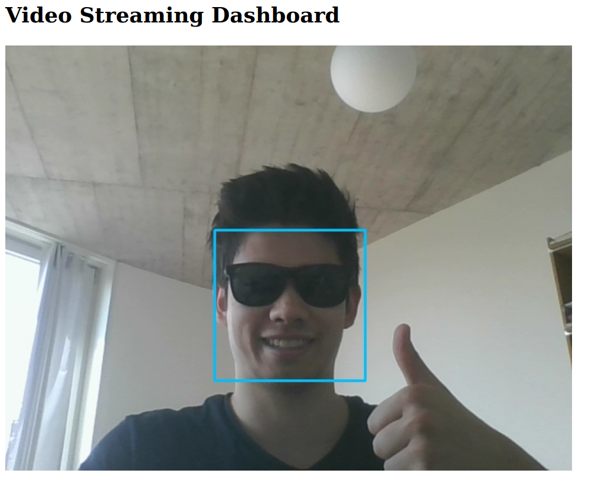

# How it works

**1. Build container:** `docker build -t cv_docker_datascience .`

**2. Run container:** `docker run -it --rm -p 5006:5006 --device=/dev/video0:/dev/video0 cv_docker_datascience`

**3. Connect to the dashboard:** In your browser, open http://localhost:5006/

# Dashboard overview

# Credits
https://github.com/log0/video_streaming_with_flask_example

https://github.com/informramiz/Face-Detection-OpenCV
