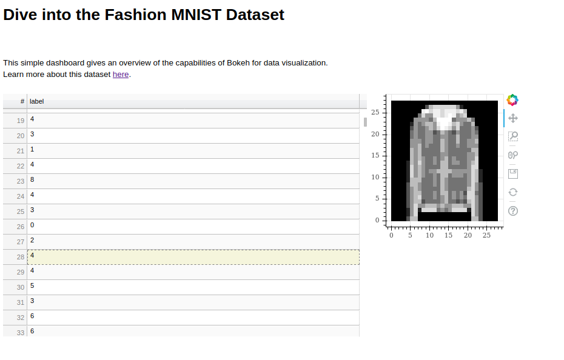

# How it works

**1. Build container:** `docker build -t dl_docker_datascience .`

**2. Run container:** `docker run -it --rm -p 5006:5006 dl_docker_datascience`

**3. Connect to the dashboard:** In your browser, open http://localhost:5006/dashboard

# Dashboard overview

